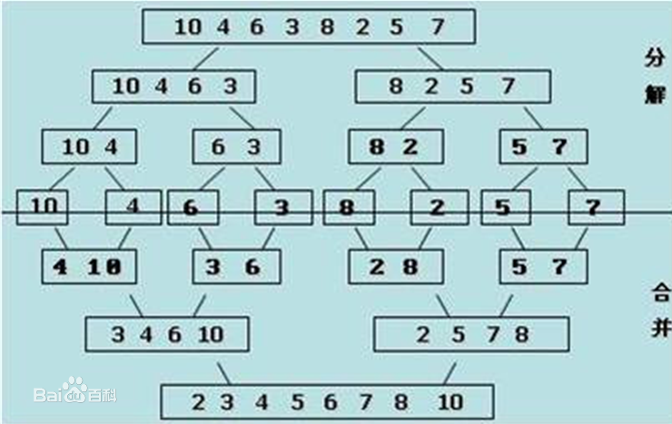

# 排序算法(下)
---
## 2.排序算法(O(nlogn)时间复杂度)

### 2.1归并排序

**核心思想**:

将对于的数组以 `size = arr.length / 2` 递归下去，直到`size = 1`时就遍历到数组的每一个元素，而最**核心的思想**是如何将两个有序的数组合并成一个数组且有序。

方法：拷贝待排序的两组数组（为了好理解表述的是两组数组，其实待排序数组中的一段），然后维护三个索引值。

- cope出的数组：copeArr[left,right]
- 第一个有序数组：arr1[left,mid]
- 第二个有序数组：arr2[mid+1,right]

每次拿出第一个与第二个数组的元素来比较
```
//伪代码
if(arr1[left] > arr2[mid + 1]){
    copeArr[left] = arr2[mid + 1];
    //扫描arr2数组 索引 +1
    //扫描copeArr数组 索引 +1
    //反之
}
```

**排序分解图**:



```java
    /**
     * 归并操作 将 arr1[left...mid] arr2[mid+...right]两数组合并
     * @param  {[type]} int[] arr           [待排序数组]
     * @param  {[type]} int   left          [左边索引]
     * @param  {[type]} int   mid           [中间索引]
     * @param  {[type]} int   right         [右边索引]
     * @return {[type]}       [void]
     */
    privite static void merge(int[] arr,int left,int mid,int right){
        int[] aux = Arrays.copyOfRange(arr, left, right);
        //第一个数组的开始索引
        int j = left;
        //第二个数组的开始索引
        int k = mid + 1;
        for(int i = left ; i <=  right ; i++){
            if(k > right){
                arr[i] = aux[k - left];
                k++;
            }else if(j > mid ){
                arr[i] = aux[j - left];
                j++;
            }else if(aux[j - left] > aux[k - left]){
                arr[i] = aux[k - left];
                k++;
            }else {
                arr[i] = aux[j - left];
                j++;
            }
        }
    }

    privite static void mergeSort(int[] arr, int left,int right){
        if(left >= right){
            return;
        }
        int mid = (right + left) / 2;
        //从左边开始分割
        mergeSort(arr,left,mid);
        //从右边开始分割
        mergeSort(arr,mid+1,right);
        //归并
        merge(arr,left,mid,right);
    }

    public static void mergeSort(int[] arr){
        mergeSort(int[] arr,0,arr.length - 1);
    }

```

**总结**：这样就可以通过并列寻找，每一次内循环都是从*两个方向*来排序的方式减少内循环的次数，达到时间复杂度为O(nlogn)的级别

#### 2.1.1归并排序优化
**优化一:**

优化递归到底的情况，在最后的小序列时，可以采用插入排序算法。因为小序列本就有序性很高，这是插入排序会比归并排序的时间复杂度的期望值要高。

此也为所有O(nlogn)算法的通用优化方案。

**优化二：**

对于近乎有序的数组排序时，可以加上一则谈判，在进入`merge`方法前，判断 `arr[min+1] > arr[mid]`为`true`时，说明两数组本就有序，不需要`merge`。

但是这种优化也不一定会有效，可以参考[排序算法 (O(n^2)时间复杂度)](/2017-11-03-O(n^2)排序算法思想.md)，中测试的优化冒泡排序的数据。
**原因：在jvm中产生了多余值及更多赋值，导致消耗性能。**


### 3.快速排序(20世纪最伟大的算法之一) 未完待续...

